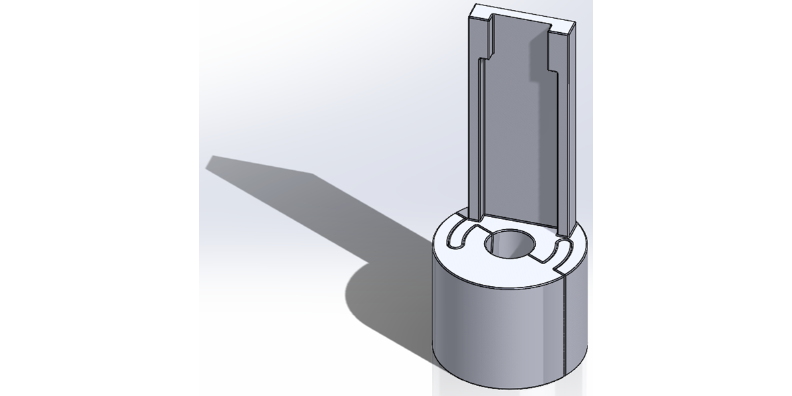
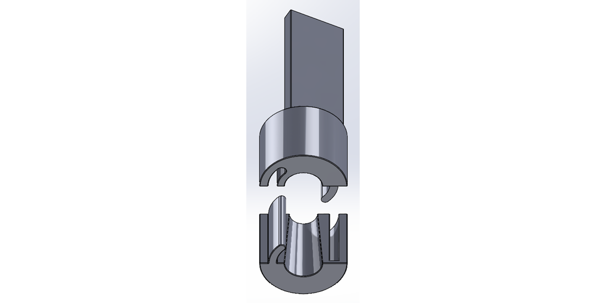
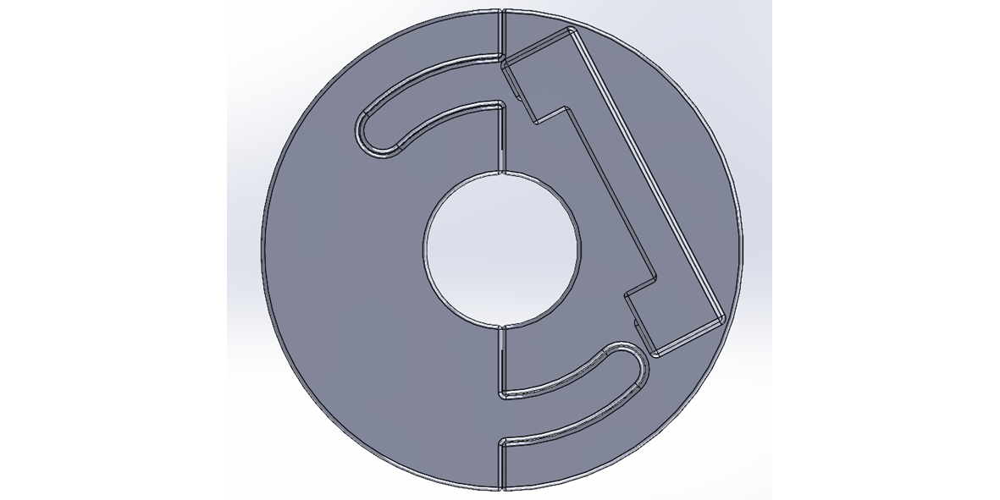

# IMU-Ultrasound-Probe-Support

**The probe support is a device that keeps a medical scanning probe stable and fixed as the user moves his hand around the body.**

The main characteristics of the product are the following :
- It is designed to stay in place and avoid any sliding of the parts one against eachother 
- It has an offset from the user's finger whilst gripping properly to the non-flexible part 
- It is replicable, meaning that it can be easily 3D printed to have a copy when needed 
- It is designed so as to easily be placed the same way everytime it is removed 
- It does not have any electromagnetic interference 

## Initial ideas (brainstorming)

- The parts have a conical hole to match the shape of the cable.  
- Sharp edges are replaced with rounded edges to avoid stress concentrations. 

## Here are the views of the device in it's final version 

#### Top isometric view 

#### Bottom isometric view with parts separated 

#### Top view 

