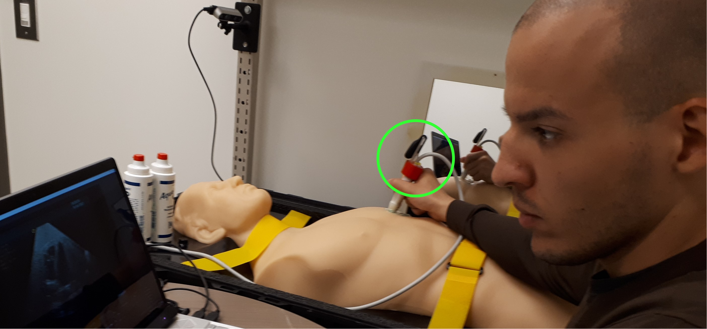
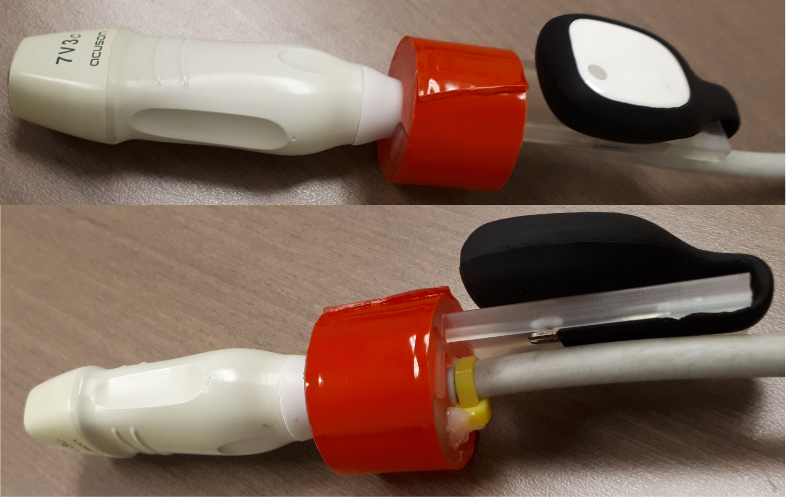
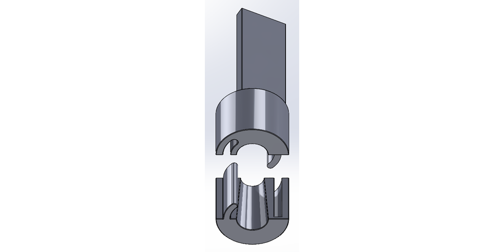
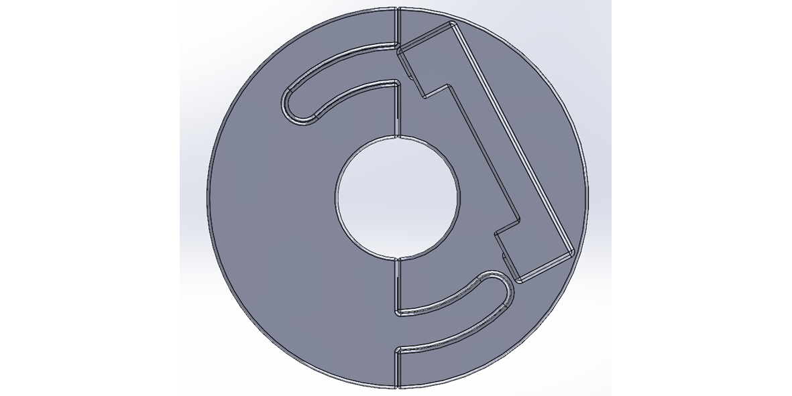

# IMU Support

This custom support equips a [Siemens Acuson Cypress](https://www.ultrasoundportables.com/by-manufacturer/siemens-acuson/siemens-acuson-cypress) US probe with a mounting point for [commercial IMUs](https://mbientlab.com/store/pocket-clip-kit-for-mmrl/), enabling probe orientation tracking. The support can also be colored (via paint or tape) to facilitate position tracking with an RGB D camera.

## Support design

<ins>The main design goals were the following</ins>

* Ensure the support can be tightly secured to the probe, while also being removable. 
* Provide a sufficient distance between the assembly and the sonographer's fingers to ensure an ergonomic grip.
* Make the support replicable meaning it can be easily 3D printed to have a copy when needed.

The support is composed of 2 parts that slide into each other to lock and embrace the shape of the probe's base (where the wire meets the probe). Once positioned, the support can be secured with a zip tie and glue (see image below).

## Views of the assembly

**
Top isometric view
**

**
Bottom isometric view with parts separated
**

**
Top view
**

Credits : [Mobin Mir Shekari](https://www.linkedin.com/in/mobinmirshekari/)
